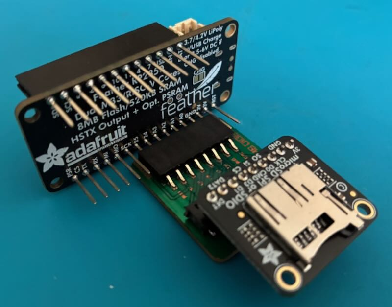
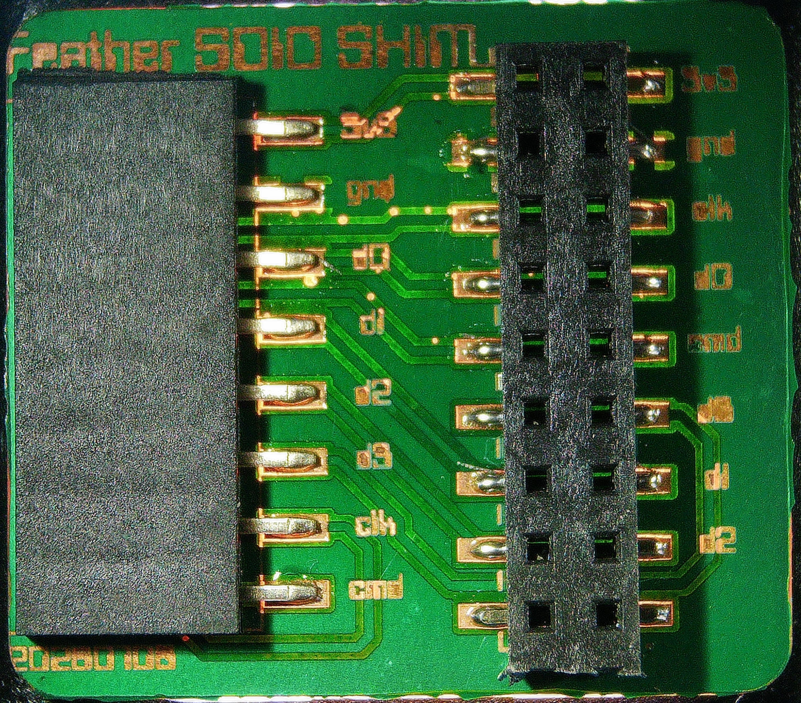
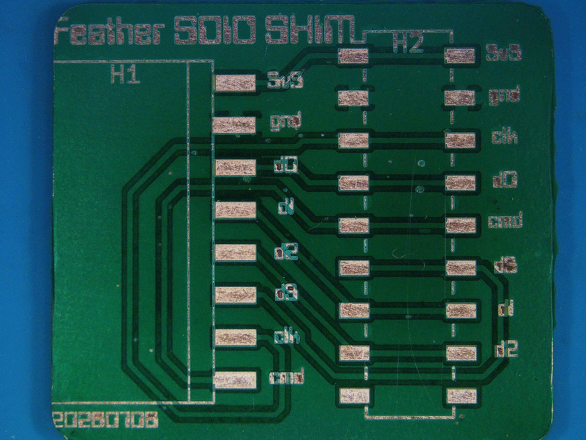
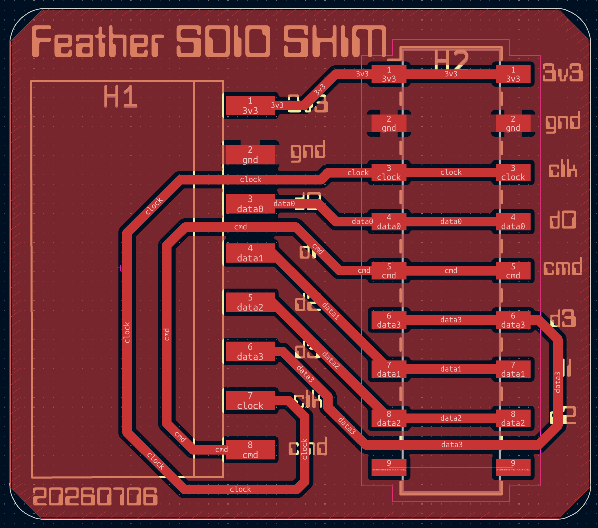
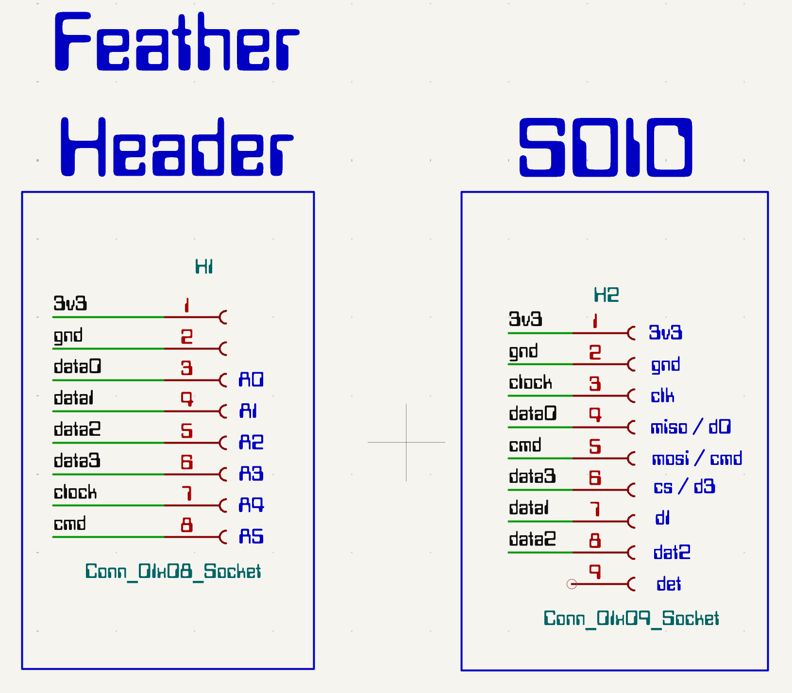

# sdio-shim

A direct-connect shim PCB that mates the Adafruit SDIO microSD breakout to a Feather — no breadboard required.

## About

A simple **passive shim** that routes a Feather's analog-rail pins to an SDIO microSD breakout (Adafruit **#4682** or a fork of it), so a stock 4-bit SDIO card hangs off any Feather **without eating the SPI, UART, or I2C buses**.

No active parts. It's a router: Feather header on one side, breakout connector on the other, eight nets between them. The shim itself carries **zero components** — the #4682 already provides the pull-ups, bypass/bulk caps, and card-detect resistor the SDIO spec requires.

Design files are in [`kicad/`](kicad/).

## Feather pinout

Chosen so the six SD logic lines land on **contiguous** Feather positions (A0→D25) while leaving every labeled bus free.

| Feather | GPIO | SDIO signal | Notes |
|---------|:----:|-------------|-------|
| 3V      | —    | Power       | |
| GND     | —    | Ground      | |
| A0      | 26   | DAT0        | data block **must stay consecutive** (PIO) |
| A1      | 27   | DAT1        | |
| A2      | 28   | DAT2        | |
| A3      | 29   | DAT3        | |
| D24     | 24   | CLK         | any GPIO — placed here to stay on-rail |
| D25     | 25   | CMD         | |

**Freed for peripherals:** SCK/MOSI/MISO (GPIO22/23/20 — full SPI bus), TX/RX (GPIO0/1 — UART0), SDA/SCL (I2C, other rail). Card-detect is **dropped** (leave the breakout's DET pad unconnected).

D24/D25 carry CLK/CMD because they sit physically right after A0–A3 on the rail and are plain GPIOs — so the SD wiring stays crossing-free and costs you nothing labeled. TX/RX would work electrically but would burn the UART.

### CircuitPython usage

```python
import board, sdioio, storage
sd = sdioio.SDCard(
    clock=board.D24,
    command=board.D25,
    data=(board.A0, board.A1, board.A2, board.A3),
    frequency=37_500_000,
)
storage.mount(storage.VfsFat(sd), "/sd")
```

## Throughput

Measured bulk transfer over 4-bit SDIO in CircuitPython, using the [Adafruit benchmark setup](https://learn.adafruit.com/microsd-optimization-circuitpython/benchmark-setup). Both boards use this shim with the [Adafruit MicroSD SPI/SDIO breakout (#4682)](https://www.adafruit.com/product/4682).

| Chip     | Board                | Bus  | Clock (MHz) | Write (MB/s) | Read (MB/s) |
|----------|----------------------|------|:-----------:|:------------:|:-----------:|
| RP2350   | Feather + SDIO Shim  | SDIO | 37.5        | 14.9         | 13.0        |
| ESP32-S3 | Feather + SDIO Shim  | SDIO | 40          | 4.5          | 7.1         |

## Photos & board files

### Assembled


### Blank


### PCB


### Schematic


## License

[GPLv3](LICENSE)
